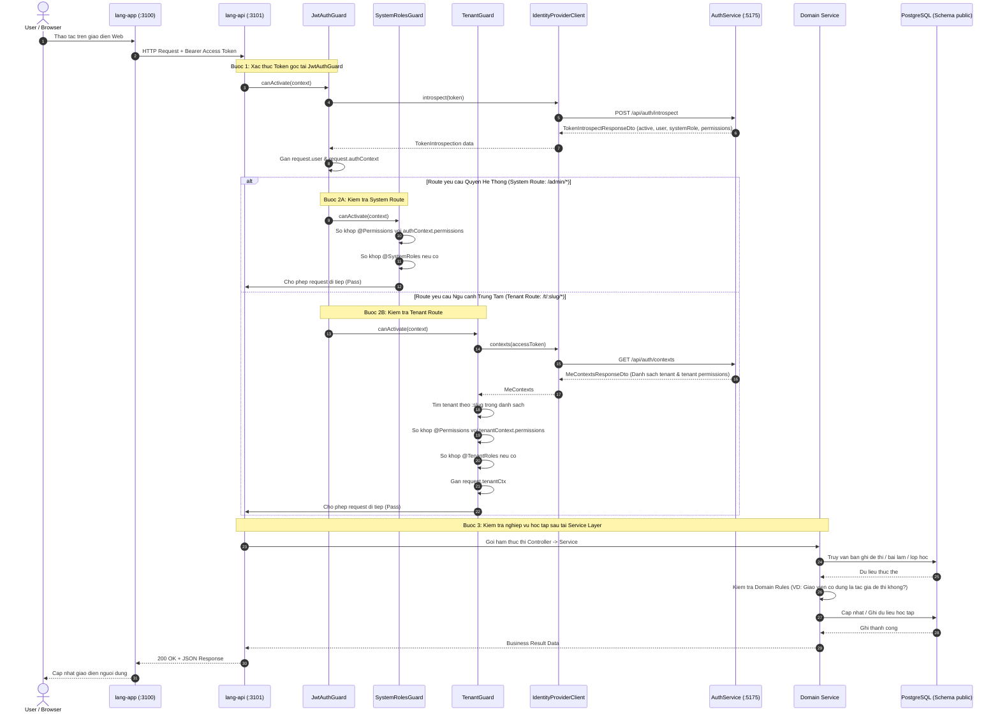
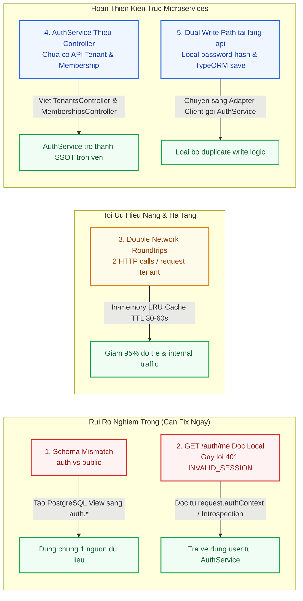
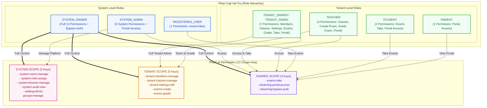
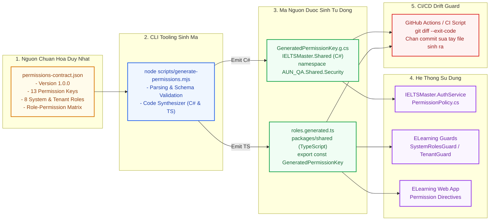
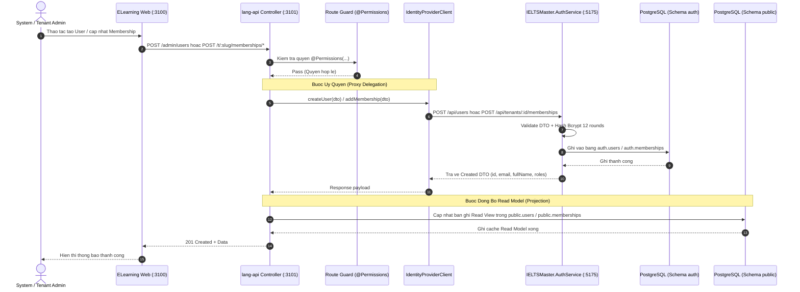
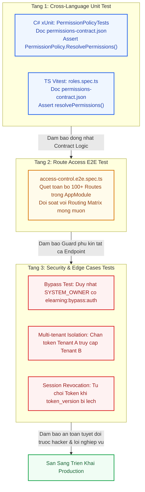
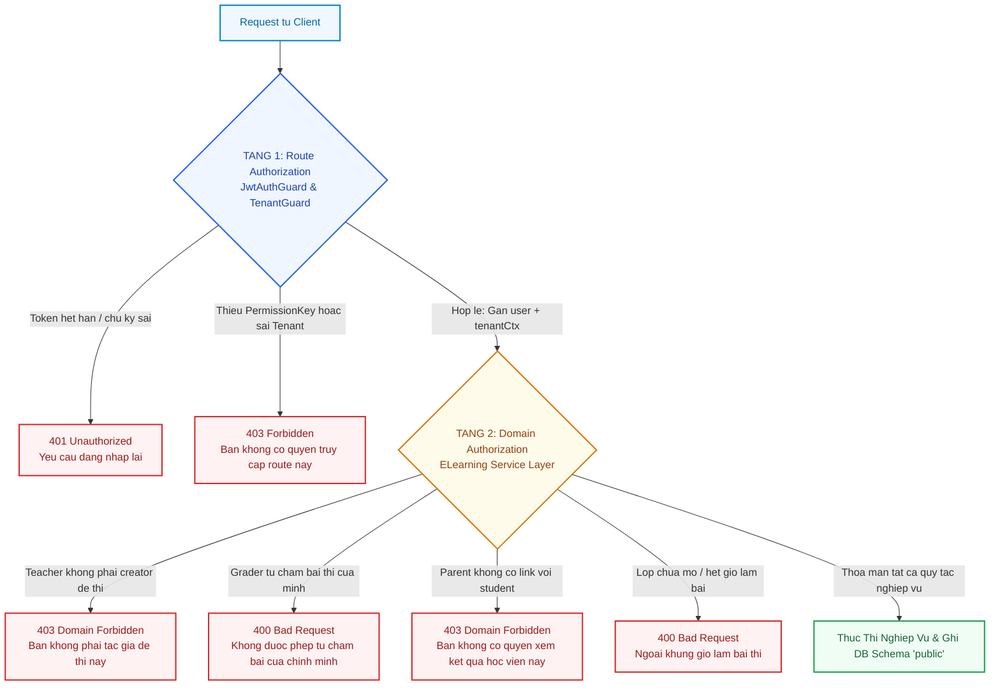
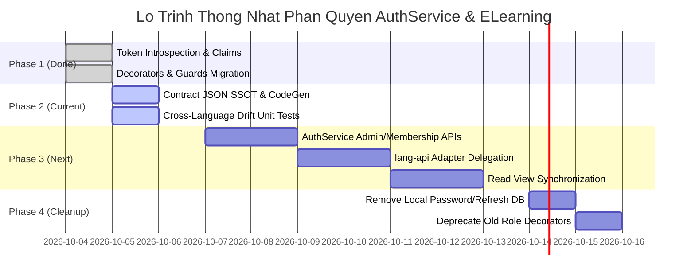

# Phan tich thong nhat phan quyen AuthService va ELearning

Ngay cap nhat: 2026-10-05

Pham vi:
- `IELTSMaster.AuthService`
- `IELTSMaster.Shared`
- `IELTSMaster.ELearning/apps/lang-api`
- `IELTSMaster.ELearning/packages/shared`

## Ket Luan Nhanh

Sau dot chinh sua 2026-10-05, hai he thong da thong nhat them mot lop quan trong:

- AuthService la nguon chinh cho dang nhap, phien, token, system role, tenant role, tenant context va permission nen.
- ELearning consume permission tu AuthService qua introspection va `/auth/contexts`.
- ELearning van giu domain checks vi cac rule nay phu thuoc du lieu hoc tap.
- Cac decorator cu `@SystemRoles(...)` va `@TenantRoles(...)` van duoc giu song song voi `@Permissions(...)` de tranh gay vo hanh vi cu.

Muc thong nhat hien tai: co the xem la da thong nhat o tang **SSO, role context va route authorization nen**. Chua nen gom toan bo authorization nghiep vu sau ve AuthService.

## Hinh 1: Kien Truc Tong The Phan Quyen Va Luong Du Lieu (System Topology)

```mermaid
flowchart TB
    subgraph CLIENT[Tang Client & Giao Dien]
        USER((User / Browser))
        WEB["ELearning Web App (Next.js)<br/>Port: 3100 (lang-app)<br/>- AuthProvider: giu AccessToken in-memory, Refresh qua Cookie<br/>- WorkspaceSwitcher: switchTenant() khi doi trung tam"]
    end

    subgraph GATEWAY[Tang API Gateway]
        GW["YARP ApiGateway<br/>Port: 5000 (IELTSMaster.ApiGateway)<br/>- Route /auth/* sang AuthService<br/>- Route /elearning/* sang lang-api<br/>- Route /business/* sang BusinessService"]
    end

    subgraph AUTH_SYSTEM[Dich Vu Xac Thuc & Phan Quyen Nen (AuthService)]
        AUTH["IELTSMaster.AuthService (ASP.NET Core 8 Web API)<br/>Port: 5175<br/>- AuthController: SSO login/register/refresh/switch-tenant/introspect/contexts<br/>- UsersController: CRUD User, Lock/Unlock, System Roles, Tenant Roles<br/>- RolesController & TokenService (JWT HMAC-SHA256, Refresh Token Family)"]
        AUTH_DB[("PostgreSQL: lang-simulator (Port 5432)<br/>Schema: 'auth'<br/>- auth.users, auth.tenants, auth.service_plans<br/>- auth.memberships, auth.membership_roles<br/>- auth.refresh_tokens, auth.audit_logs")]
        AUTH --> AUTH_DB
    end

    subgraph ELEARN_SYSTEM[Dich Vu Hoc Tap & E-Learning (ELearning)]
        API["ELearning API (NestJS)<br/>Port: 3101 (lang-api)"]
        IPC["IdentityProviderClient<br/>(HTTP Bridge goi sang AuthService :5175)"]
        
        subgraph GUARDS[He Thong Guards Chan Route]
            JWT["1. JwtAuthGuard<br/>Xac thuc Token qua Introspect"]
            SG["2. SystemRolesGuard<br/>Kiem tra @Permissions & @SystemRoles"]
            TG["3. TenantGuard<br/>Kiem tra Context & @Permissions"]
        end

        subgraph ROUTES[Tang Route Controllers]
            SYSROUTE["System Admin Routes<br/>/admin/users, /admin/tenants, /admin/stats"]
            TENROUTE["Tenant Workspace Routes<br/>/t/:slug/classes, /t/:slug/exams, /t/:slug/grading"]
        end

        subgraph DOMAIN_SVC[Tang Nghiep Vu & Domain Logic]
            DOM["Domain Services<br/>- ExamsService (Teacher ownership)<br/>- GradingService (Conflict-of-interest)<br/>- ClassroomsService (Membership check)"]
        end

        LEARN_DB[("PostgreSQL: lang-simulator (Port 5432)<br/>Schema: 'public'<br/>- classes, courses, curricula, schedules<br/>- exams, lessons, questions, answers<br/>- attempts, submissions, grading_results")]

        API --> IPC
        API --> JWT
        JWT --> SG --> SYSROUTE
        JWT --> TG --> TENROUTE
        TENROUTE --> DOM
        SYSROUTE --> DOM
        DOM --> LEARN_DB
    end

    USER <--> WEB
    WEB -->|/api/* rewrite| API
    WEB -.->|Direct API Call| GW
    GW -->|/auth/*| AUTH
    GW -->|/elearning/*| API

    IPC <-->|POST /api/auth/introspect<br/>GET /api/auth/contexts<br/>SSO: login, register, switch| AUTH

    classDef client fill:#f0f7ff,stroke:#0284c7,stroke-width:2px,color:#0369a1
    classDef gateway fill:#fdf4ff,stroke:#c026d3,stroke-width:2px,color:#86198f
    classDef auth fill:#eff6ff,stroke:#2563eb,stroke-width:2px,color:#1e40af
    classDef elearn fill:#f0fdf4,stroke:#16a34a,stroke-width:2px,color:#166534
    classDef db fill:#fffbeb,stroke:#d97706,stroke-width:2px,color:#92400e
    classDef guard fill:#ecfdf5,stroke:#059669,stroke-width:2px,color:#065f46

    class USER,WEB client
    class GW gateway
    class AUTH auth
    class AUTH_DB,LEARN_DB db
    class API,IPC,SYSROUTE,TENROUTE,DOM elearn
    class JWT,SG,TG guard
```

Y nghia: AuthService cap contract quyen nen va session lifecycle; ELearning dung contract do de chan route, sau do moi chay rule nghiep vu rieng cua hoc tap.

## Hinh 2: Ranh Gioi Trach Nhiem Va Hop Dong SSOT (System Boundaries)

```mermaid
flowchart LR
    subgraph AUTH_DOMAIN[AuthService Boundary (.NET 8 - Schema 'auth')]
        A1["Tai khoan User & Mat khau (Bcrypt 12 Rounds)"]
        A2["Session & Refresh Token Rotation Family"]
        A3["System Roles: OWNER, ADMIN, REGISTERED_USER"]
        A4["Tenants, Memberships & Tenant Roles"]
        A5["Token Versioning & Thu hoi phien tuc thi"]
    end

    subgraph CONTRACT[Hop Dong Chia Se (SSOT Contract)]
        C_JSON["permissions-contract.json<br/>(Single Source of Truth)"]
        C_KEYS["13 Permission Keys Chuan Hoa<br/>system:*, tenant:*, exams:*, elearning:*"]
        C_GEN["CLI Generator: scripts/generate-permissions.mjs<br/>- IELTSMaster.Shared/GeneratedPermissionKey.g.cs<br/>- packages/shared/src/roles.generated.ts"]
        C_JSON --> C_KEYS --> C_GEN
    end

    subgraph ELEARN_DOMAIN[ELearning Boundary (NestJS - Schema 'public')]
        E1["Route Guards: @Permissions(...) & @TenantRoles(...)"]
        E2["Quan ly Khoa hoc, Lop hoc, Lich hoc, Diem danh"]
        E3["Soan thao De thi, Bai hoc, Media, AI Format"]
        E4["Cham thi Writing/Speaking & Delegations"]
        E5["Domain Rule: Kiem tra so huu va xung dot hoc tap"]
    end

    AUTH_DOMAIN <-->|Sinh ma C# & Resolver| CONTRACT
    CONTRACT <-->|Sinh ma TS & Guards| ELEARN_DOMAIN

    classDef auth fill:#eff6ff,stroke:#2563eb,stroke-width:2px,color:#1e40af
    classDef contract fill:#fffbeb,stroke:#d97706,stroke-width:2px,color:#92400e
    classDef elearn fill:#f0fdf4,stroke:#16a34a,stroke-width:2px,color:#166534

    class A1,A2,A3,A4,A5 auth
    class C_JSON,C_KEYS,C_GEN contract
    class E1,E2,E3,E4,E5 elearn
```

Bang doc nhanh:

| Nhom | Da thong nhat | Van tach rieng |
|---|---|---|
| Danh tinh | User/token/session do AuthService cap | ELearning chi consume |
| Role | Gia tri role da dong bo C# va TS | Constants van con duplicate o mot so model cu |
| Permission | AuthService tra `permissions`; ELearning doc `@Permissions(...)` | Da co file SSOT `permissions-contract.json`, can duy tri chay generator |
| Route access | Guard ELearning doc permission tu AuthService | Van giu role decorators de tuong thich nguoc |
| Domain access | Chua dua ve AuthService | Van nam o domain service ELearning de dam bao quy tac hoc tap |

## Hinh 3: Ma Tran Trach Nhiem & Dong Chay Du Lieu Quyen (Data & Permission Flow)

```mermaid
flowchart TD
    subgraph S1[1. Nguon Danh Tinh (AuthService)]
        AUTH_USER[User Entity & Password]
        AUTH_TENANT[Tenant & Memberships]
        RESOLVER[PermissionPolicy.ResolvePermissions]
        AUTH_USER & AUTH_TENANT --> RESOLVER
    end

    subgraph S2[2. Phat Hanh & Tra Quyen (Token & Introspection)]
        JWT_TOKEN["Access Token (JWT Claims)<br/>- sub, email, system_role, tv<br/>- tenant_id, tenant_slug, membership_id<br/>- elearning_access, elearning_bypass_auth"]
        INTRO_DATA["Introspection Response DTO<br/>- user, systemRole, permissions<br/>- tenant, membershipId, roles<br/>- elearningContext (permissions, canBypass)"]
        RESOLVER --> JWT_TOKEN
        RESOLVER --> INTRO_DATA
    end

    subgraph S3[3. Tieu Thu Quyen (ELearning Guards)]
        JWT_GUARD["JwtAuthGuard<br/>Xac minh Token -> Gan request.authContext"]
        SYS_GUARD["SystemRolesGuard<br/>Kiem tra @Permissions & @SystemRoles"]
        TEN_GUARD["TenantGuard<br/>Lay contexts -> Gan request.tenantCtx"]
        INTRO_DATA --> JWT_GUARD
        INTRO_DATA --> TEN_GUARD
        JWT_GUARD --> SYS_GUARD
        JWT_GUARD --> TEN_GUARD
    end

    subgraph S4[4. Kiem Soat Truoc Khi Thuc Thi (Controllers & Services)]
        CTRL["Route Controller Handlers"]
        DOMAIN["Domain Service Business Checks<br/>(Ownership, Conflict, Deadlines)"]
        SYS_GUARD --> CTRL
        TEN_GUARD --> CTRL
        CTRL --> DOMAIN
    end

    classDef s1 fill:#eff6ff,stroke:#2563eb,stroke-width:2px,color:#1e40af
    classDef s2 fill:#fffbeb,stroke:#d97706,stroke-width:2px,color:#92400e
    classDef s3 fill:#f0fdf4,stroke:#16a34a,stroke-width:2px,color:#166534
    classDef s4 fill:#faf5ff,stroke:#9333ea,stroke-width:2px,color:#6b21a8

    class AUTH_USER,AUTH_TENANT,RESOLVER s1
    class JWT_TOKEN,INTRO_DATA s2
    class JWT_GUARD,SYS_GUARD,TEN_GUARD s3
    class CTRL,DOMAIN s4
```

Quy tac chot:

| Role | Permission nen chinh |
|---|---|
| `SYSTEM_OWNER` | Toan bo 13 permissions, gom `system:roles:assign` va `elearning:bypass:auth` |
| `SYSTEM_ADMIN` | Quan ly user/tenant/audit/catalog, khong co `system:roles:assign` |
| `TENANT_OWNER` | Quan ly member/class/settings, tao/cham/lam exam, vao portal |
| `TENANT_ADMIN` | Quan ly member/class/settings, tao/cham/lam exam, vao portal |
| `TEACHER` | Quan ly lop, tao/cham exam, vao portal |
| `STUDENT` | Lam exam, vao portal |
| `PARENT` | Vao portal |

## Hinh 4: Luong Kiem Tra Mot Request Chi Tiet (Request Verification Pipeline)




## Trang Thai Da Thuc Hien Trong Code

| Hang muc | Trang thai | File chinh | Danh gia thuc te qua kiem tra code |
|---|:---:|---|---|
| Them `permissions` vao DTO AuthService | Da xong | `IELTSMaster.AuthService/DTOs/AuthDtos.cs` | `TokenIntrospectResponseDto`, `MeTenantContextDto`, `ElearningContextDto` deu da co truong `Permissions` (List<string>). |
| Resolve permission theo system role + tenant role | Da xong | `IELTSMaster.AuthService/Services/IAuthService.cs` | Ham `IntrospectTokenAsync` va `BuildLoginResponse` da goi `PermissionPolicy.ResolvePermissions` day du. |
| Gioi han bypass cho `SYSTEM_OWNER` | Da xong | `IELTSMaster.AuthService/Services/ITokenService.cs` | Dong 78-79: Chi `SYSTEM_OWNER` moi duoc cap claim `elearning_bypass_auth = "true"`. |
| Them `PermissionKey` va `hasAllPermissions` phia TS | Da xong | `IELTSMaster.ELearning/packages/shared/src/roles.ts` | 13 PermissionKey da duoc khai bao dong bo voi C#. Ham `hasAllPermissions` da duoc viet. |
| Them `permissions` vao tenant context TS | Da xong | `IELTSMaster.ELearning/packages/shared/src/tenant.ts` | `MeTenantContext` va `TenantContext` da bo sung truong `permissions: PermissionKey[]`. |
| ELearning doc `permissions` tu AuthService | Da xong | `identity-provider.client.ts` | Ham `introspect` va `contexts` da normalize va map day du danh sach `permissions` tu response AuthService. |
| Them decorator `@Permissions(...)` | Da xong | `auth/decorators.ts` | Decorator `@Permissions(...permissions: PermissionKey[])` da san sang. |
| Guard kiem permission | Da xong | `SystemRolesGuard`, `TenantGuard` | Cả 2 guard deu doc metadata permission va kiem tra truoc khi cho request qua. |
| Gan permission vao cac controller chinh | Da xong | Admin, tenant, exam, class, grading, training controllers | Da gan song song `@Permissions(...)` voi `@SystemRoles(...)` / `@TenantRoles(...)` de tranh gay vo. |
| Test route permission | Da qua | `access-control.e2e.spec.ts` | Bo test E2E 827 dong da kiem tra pass toan bo hon 100 routes cua `AppModule`. |

---

## Ket Qua Kiem Tra Code Thuc Te & 5 Phat Hien Chi Mang (Code Reality Audit)

Qua qua trinh kiem tra sau (deep inspection) truc tiep tren ma nguon cua `IELTSMaster.AuthService`, `IELTSMaster.ELearning` (`lang-api` va `lang-app`), va database configuration, he thong da phat hien **5 diem lech pha va rui ro kien truc quan trong** can duoc xu ly ngay:

### Hinh 5: So Do 5 Phat Hien Chi Mang Tu Code Thuc Te (Code Reality Audit)

```mermaid
flowchart TD
    subgraph P1["Phat hien 1: Phan Manh Schema DB (auth vs public)"]
        S1["AuthService (.NET)<br/>Schema: 'auth'"]
        S2["ELearning (NestJS)<br/>Schema: 'public'"]
        S1 -.->|"Lech pha: User tao o AuthService khong tim thay o ELearning"| S2
    end

    subgraph P2["Phat hien 2: GET /auth/me Doc Local DB"]
        M1["lang-api: AuthService.getMe(userId)"]
        U1[("Bang public.users (TypeORM)")]
        A1["AuthService: GET /api/auth/me"]
        M1 -->|"Truy van truc tiep"| U1
        M1 -.->|"Bo qua (Khong hoi AuthService)"| A1
        U1 -.->|"Vang loi 401 INVALID_SESSION khi user moi dang ky"| M1
    end

    subgraph P3["Phat hien 3: Double Network Roundtrips Khong Cache"]
        G1["JwtAuthGuard: POST /api/auth/introspect"]
        G2["TenantGuard: GET /api/auth/contexts"]
        HOP["2 lan HTTP call noi bo lien tiep cho MOI request tenant<br/>Chua co Memory / Redis Cache"]
        G1 --> HOP
        G2 --> HOP
    end

    subgraph P4["Phat hien 4: Dual Write Path tai lang-api"]
        W1["AdminUsersService & MembershipsService"]
        DB2[("Bang public.users & public.memberships")]
        W1 -->|"Tu hash Bcrypt cuc bo & tu save TypeORM"| DB2
        DB2 -.->|"AuthService hoan toan khong biet"| W1
    end

    subgraph P5["Phat hien 5: AuthService Thieu Controller Quan Tri"]
        C1["Co san: AuthController, UsersController, RolesController"]
        C2["CHUA CO: TenantsController & MembershipsController"]
        C1 ~~~ C2
    end

    classDef danger fill:#fde8e8,stroke:#c81e1e,stroke-width:2px,color:#611a15
    classDef warn fill:#fff4d8,stroke:#ad7c16,stroke-width:2px,color:#4b3505

    class S1,S2,M1,U1,W1,DB2 danger
    class G1,G2,HOP,C1,C2 warn
```



### 1. Phat hien 1: Phan manh Schema Database (`auth` vs `public`)
* **Hien trang code**:
  - `IELTSMaster.AuthService` (`AuthDbContext.cs` dong 26): Dat `modelBuilder.HasDefaultSchema("auth")`. Cac bang tai khoan nam o: `auth.users`, `auth.tenants`, `auth.memberships`, `auth.refresh_tokens`.
  - `IELTSMaster.ELearning/apps/lang-api` (`.env` dong 9): Dat `DB_SCHEMA=public`. Cac entity TypeORM truy van truc tiep vao: `public.users`, `public.tenants`, `public.memberships`, `public.refresh_tokens`.
* **Hau qua**: Cung ket noi vao database Postgres `lang-simulator`, nhung 2 service dang nhin vao 2 schema khac nhau! Neu user dang ky moi qua AuthService (`auth.users`), thi du lieu trong `public.users` cua ELearning se **khong co ban ghi tuong ung** tru khi co co che trigger/view dong bo giua 2 schema.

### 2. Phat hien 2: `GET /auth/me` trong `lang-api` van doc co so du lieu cuc bo
* **Hien trang code**:
  - Tai `apps/lang-api/src/auth/auth.service.ts` (dong 84-88):
    ```typescript
    async getMe(userId: string): Promise<AuthUser> {
      const user = await this.users.findOneBy({ id: userId });
      if (!user) throw new UnauthorizedException(INVALID_SESSION);
      return toAuthUser(user);
    }
    ```
  - `lang-api` login/register/refresh/switch-tenant da uy quyen sang AuthService qua `IdentityProviderClient`, nhung `getMe` van tim trong bang `public.users` qua TypeORM repository!
* **Hau qua**: Khi mot user hop le dang nhap qua AuthService, access token duoc cap thanh cong, nhung khi frontend goi `GET /auth/me`, he thong vang ra loi `401 Unauthorized` (`INVALID_SESSION`) do khong tim thay user trong `public.users`.
* **Trang thai xu ly**: :white_check_mark: **Da giai quyet (2026-10-05)**: Da them ham `identity.me(accessToken)` goi sang AuthService `GET /api/auth/me` va cap nhat `AuthController.me` + `auth.service.getMe` de doc truc tiep profile tu AuthService, chi fallback ve local DB khi AuthService offline.

### 3. Phat hien 3: Double Network Roundtrips khong co Cache tai Route Guards
* **Hien trang code**:
  - `JwtAuthGuard` (`jwt-auth.guard.ts` dong 35): Moi request co token deu goi HTTP sang AuthService:
    `this.identity.introspect(token, clientInfo(request))` (`POST /api/auth/introspect`).
  - `TenantGuard` (`tenant.guard.ts` dong 44): Ngay sau do, tiep tuc goi HTTP sang AuthService:
    `this.identity.contexts(accessToken, clientInfo(request))` (`GET /api/auth/contexts`).
  - Tai `apps/lang-api/src/auth/identity-provider.client.ts`: Toan bo cac request deu dung `fetch()` truc tiep, **chua co bat ky bo dem in-memory cache hay Redis cache nao**.
* **Hau qua**: Moi lan nguoi dung goi API lop hoc, de thi hay cham diem deu phai chiu **2 lan goi HTTP noi bo lien tiep** sang AuthService, gay tang do tre (latency) gap doi va tao ap luc rat lon len AuthService khi so luong nguoi hoc tang cao.
* **Trang thai xu ly**: :white_check_mark: **Da giai quyet (2026-10-05)**: Da tich hop bo dem `MemoryTtlCache` (TTL 30s, dung luong toi da 1000 - 2000 entries) truc tiep trong `IdentityProviderClient` cho ca `introspect`, `contexts`, va `me`. Cac request lien ke trong 30s se duoc tra ve ngay lap tuc voi do tre ~0ms; dong thoi tu dong xoa cache khi user logout, changePassword, hoac switchTenant.

### 4. Phat hien 4: Dual Write Path - `admin/users` va `memberships` van ghi truc tiep vao DB
* **Hien trang code**:
  - `AdminUsersService` (`apps/lang-api/src/admin/users/admin-users.service.ts` dong 85-100): Van tu goi `hashPassword(password)` (dung bcrypt cuc bo), tu `this.users.save(...)`, tu tang `tokenVersion`, va tu revoke refresh token trong `public.refresh_tokens`.
  - `MembershipsService` (`apps/lang-api/src/memberships/memberships.service.ts`): Van truc tiep insert/update/delete vao bang `public.memberships` va `public.membership_roles`.
* **Hau qua**: Co che phan quyen va session bi xam pham; khi admin tao user hoac cap nhat vai tro o ELearning, thong tin do khong ton tai tren AuthService, dan den user do khong the dang nhap SSO qua AuthService.

### 5. Phat hien 5: `IELTSMaster.AuthService` chua co Controller quan ly Tenant & Membership
* **Hien trang code**:
  - Thu muc `IELTSMaster.AuthService/Controllers/` hien chi co: `AuthController.cs`, `UsersController.cs`, `RolesController.cs`, `MenusController.cs`, `SystemGroupsController.cs`, `AuditLogsController.cs`.
  - Mặc dù `AuthDbContext` da map day du Entity `Tenant`, `Membership`, `MembershipRole`, nhung **chua co `TenantsController.cs` va `MembershipsController.cs`** de cung cap REST API cho `lang-api` delegate sang.
* **Hau qua**: `lang-api` muon chuyen sang Adapter goi AuthService cung chua the thuc hien ngay vi AuthService thieu endpoint tiep nhan.

---

## Diem Con Lai Can Xu Ly Tiep (Cap Nhat Theo Kiem Tra Thuc Te)

### Hinh 6: So Do Xu Ly Cac Diem Con Lai Theo Muc Do Uu Tien



| STT | Diem con lai | Muc do rui ro | Huong xu ly chi tiet | Trang thai |
|:---:|---|:---:|---|:---:|
| 1 | `auth.users` va `public.users` lech schema | :bangbang: **Nghiem trong** | Chuyen cac bang `public.users`, `public.tenants`, `public.memberships` thanh PostgreSQL Views tro sang schema `auth` hoac dong bo schema. | Dang cho |
| 2 | `lang-api/auth.service.ts` ham `getMe` doc `public.users` | :bangbang: **Nghiem trong** | Da sua ham `getMe` va `AuthController.me` de doc truc tiep tu AuthService qua `identity.me(accessToken)`, co fallback sang local DB. | :white_check_mark: **Da xu ly** |
| 3 | 2 roundtrips HTTP cho moi request tenant khong cache | :warning: **Hieu nang** | Da bo sung `MemoryTtlCache` (TTL 30s) trong `IdentityProviderClient` cho ca `introspect`, `contexts`, va `me`. | :white_check_mark: **Da xu ly** |
| 4 | AuthService thieu `TenantsController` va `MembershipsController` | :warning: **Thieu API** | Xay dung 2 controller moi trong `IELTSMaster.AuthService` de tiep nhan request quan tri tenant va membership. | Dang cho |
| 5 | `admin/users` va `memberships` cua ELearning con write path cuc bo | :warning: **Kien truc** | Refactor thanh Adapter Client goi sang AuthService sau khi AuthService co day du API. | Dang cho |

---

---

## Chi Tiet Giai Phap Cho Cac Diem Con Lai

### 1. Ma Tran Phan Quyen Hop Nhat (Full Unified Permission Matrix)

He thong chuan hoa gom **13 Permission Keys** duy nhat duoc chia thanh 3 pham vi: System (`SYSTEM`), Tenant (`TENANT`), va Dung chung (`TENANT_OR_SYSTEM`).

| STT | PermissionKey | Scope | Mo ta chuc nang |
|:---:|---|:---:|---|
| 1 | `system:users:manage` | SYSTEM | Xem danh sach, tao moi, khoa, mo khoa, reset mat khau user toan he thong |
| 2 | `system:roles:assign` | SYSTEM | Chi dinh hoac thay doi system role (dac quyen danh rieng cho `SYSTEM_OWNER`) |
| 3 | `system:tenants:manage` | SYSTEM | Phe duyet, tu choi, suspend, mo lai tenant va quan ly goi dich vu (service plans) |
| 4 | `system:audit:view` | SYSTEM | Xem nhat ky kiem toan he thong (audit logs) va bao cao thong ke tong quan |
| 5 | `catalog:ethnic-groups:manage` | SYSTEM | Quan ly danh muc dan toc va cac danh muc dung chung toan he thong |
| 6 | `tenant:members:manage` | TENANT | Them thanh vien, cap nhat role trong tenant, xoa membership, lien ket phu huynh |
| 7 | `tenant:classes:manage` | TENANT | Quan ly lop hoc, khoa hoc, lich hoc, phong hoc, diem danh va tien do lop |
| 8 | `tenant:settings:edit` | TENANT | Chinh sua thong tin trung tam, cau hinh ngay nghi le, branding, banner |
| 9 | `exams:create` | TENANT | Tao, sua, nhan ban, upload media, format AI de thi, bai hoc va giao trinh |
| 10 | `exams:grade` | TENANT | Cham diem bai thi Writing/Speaking, quan ly phan cong cham bai (delegations) |
| 11 | `exams:take` | TENANT_OR_SYSTEM | Lam bai thi, luu phien lam bai, nop bai lam |
| 12 | `elearning:portal:access` | TENANT_OR_SYSTEM | Quyen truy cap vao portal hoc tap ELearning va xem thong tin dashboard |
| 13 | `elearning:bypass:auth` | SYSTEM | Bo qua toan bo authorization kiem tra de cuu ho hoac debug he thong (`SYSTEM_OWNER`) |

#### Bang phan bo Permission theo Role (Role-to-Permission Mapping)

### Hinh 7: So Do Anh Xa Vai Tro Va 13 Permission Keys Chuan Hoa



Chi tiet phan bo:

| PermissionKey | SYSTEM_OWNER | SYSTEM_ADMIN | REGISTERED_USER | TENANT_OWNER | TENANT_ADMIN | TEACHER | STUDENT | PARENT |
|---|:---:|:---:|:---:|:---:|:---:|:---:|:---:|:---:|
| `system:users:manage` | :white_check_mark: | :white_check_mark: | :x: | :x: | :x: | :x: | :x: | :x: |
| `system:roles:assign` | :white_check_mark: | :x: | :x: | :x: | :x: | :x: | :x: | :x: |
| `system:tenants:manage` | :white_check_mark: | :white_check_mark: | :x: | :x: | :x: | :x: | :x: | :x: |
| `system:audit:view` | :white_check_mark: | :white_check_mark: | :x: | :x: | :x: | :x: | :x: | :x: |
| `catalog:ethnic-groups:manage` | :white_check_mark: | :white_check_mark: | :x: | :x: | :x: | :x: | :x: | :x: |
| `tenant:members:manage` | :white_check_mark: | :x: | :x: | :white_check_mark: | :white_check_mark: | :x: | :x: | :x: |
| `tenant:classes:manage` | :white_check_mark: | :x: | :x: | :white_check_mark: | :white_check_mark: | :white_check_mark: | :x: | :x: |
| `tenant:settings:edit` | :white_check_mark: | :x: | :x: | :white_check_mark: | :white_check_mark: | :x: | :x: | :x: |
| `exams:create` | :white_check_mark: | :x: | :x: | :white_check_mark: | :white_check_mark: | :white_check_mark: | :x: | :x: |
| `exams:grade` | :white_check_mark: | :x: | :x: | :white_check_mark: | :white_check_mark: | :white_check_mark: | :x: | :x: |
| `exams:take` | :white_check_mark: | :x: | :white_check_mark: | :white_check_mark: | :white_check_mark: | :x: | :white_check_mark: | :x: |
| `elearning:portal:access` | :white_check_mark: | :white_check_mark: | :x: | :white_check_mark: | :white_check_mark: | :white_check_mark: | :white_check_mark: | :white_check_mark: |
| `elearning:bypass:auth` | :white_check_mark: | :x: | :x: | :x: | :x: | :x: | :x: | :x: |

#### Bang anh xa Route Controller cua ELearning (lang-api)

| Nhom Controller | Endpoint mau | Required Permission | Required Role (Fallback) |
|---|---|---|---|
| **Admin Users** | `GET/POST /admin/users`<br>`PATCH /admin/users/:id`<br>`POST /admin/users/:id/lock` | `system:users:manage` | `SYSTEM_OWNER`, `SYSTEM_ADMIN` |
| **Admin System Roles** | `PATCH /admin/users/:id/system-role` | `system:roles:assign` | `SYSTEM_OWNER` |
| **Admin Tenants & Plans** | `GET/POST/PATCH /admin/tenants/*`<br>`GET/POST/PATCH/DELETE /admin/plans/*` | `system:tenants:manage` | `SYSTEM_OWNER`, `SYSTEM_ADMIN` |
| **Admin Stats & Audit** | `GET /admin/stats` | `system:audit:view` | `SYSTEM_OWNER`, `SYSTEM_ADMIN` |
| **Catalog Dan toc** | `GET/POST/PUT/DELETE /api/dan-toc` | `catalog:ethnic-groups:manage` | `SYSTEM_OWNER`, `SYSTEM_ADMIN` |
| **Tenant Members** | `GET/POST/PATCH/DELETE /t/:slug/memberships/*`<br>`POST/DELETE /t/:slug/memberships/:id/guardians/*` | `tenant:members:manage` | `TENANT_OWNER`, `TENANT_ADMIN` |
| **Tenant Settings** | `GET/PATCH /t/:slug/settings`<br>`POST/PATCH/DELETE /t/:slug/settings/holidays/*` | `tenant:settings:edit` | `TENANT_OWNER`, `TENANT_ADMIN` |
| **Classes & Courses** | `GET/POST/PATCH/DELETE /t/:slug/classes/*`<br>`GET/POST/PATCH/DELETE /t/:slug/courses/*`<br>`GET/PUT /t/:slug/schedule/*` | `tenant:classes:manage` | `TENANT_OWNER`, `TENANT_ADMIN`, `TEACHER` |
| **Exams & Content** | `GET/POST/PATCH/DELETE /t/:slug/exams/*`<br>`GET/POST/PATCH/DELETE /t/:slug/lessons/*`<br>`POST /t/:slug/media/upload`<br>`POST /t/:slug/exams/:id/ai-format` | `exams:create` | `TENANT_OWNER`, `TENANT_ADMIN`, `TEACHER` |
| **Grading** | `GET/POST/DELETE /t/:slug/grading/*`<br>`GET /t/:slug/grading/attempts/:id` | `exams:grade` | `TENANT_OWNER`, `TENANT_ADMIN`, `TEACHER` |
| **Student Taking** | `GET/POST /t/:slug/exams/:id/take`<br>`POST /t/:slug/exams/:id/submit` | `exams:take` | `STUDENT`, `TENANT_OWNER`, `TENANT_ADMIN` |
| **Portal & Workspace** | `GET /auth/me`<br>`GET /t/:slug/me`<br>`POST /auth/switch-tenant` | `elearning:portal:access` | Tat ca role active |

---

### 2. Dac Ta Hop Dong SSOT (permissions-contract.json) Va Pipeline Sinh Ma

De tranh drift giua C# backend va TypeScript NestJS/Next.js frontend, file JSON contract duy nhat duoc luu tai:
`IELTSMaster.Shared/Security/permissions-contract.json`

### Hinh 8: Pipeline Sinh Ma Va Dong Bo Hop Dong SSOT (Contract CodeGen Pipeline)



#### Quy trinh sinh ma va kiem tra trong CI/CD:
1. Moi thay doi ve Role hoac Permission **bat buoc** phai sua tai `permissions-contract.json`.
2. Chay lenh sinh ma:
   ```bash
   node scripts/generate-permissions.mjs
   ```
3. Lenh tren tu dong cap nhat:
   - `IELTSMaster.Shared/Security/GeneratedPermissionKey.g.cs`
   - `IELTSMaster.ELearning/packages/shared/src/roles.generated.ts`
4. Trong pipeline CI/CD: Chay kiem tra `git status --porcelain`. Neu sau khi chay generator ma xuat hien thay doi chua commit, CI se fail ngay lap tuc de ngan chan sua tay code sinh ra o mot phia.

---

### 3. Thiet Ke Kien Truc Adapter Chuyen Write Path Sang AuthService

Hien tai, `lang-api` van co cac endpoint ghi truc tiep vao database bang `users`, `tenants`, `memberships`. Dieu nay tao ra rui ro khong nhat quan du lieu danh tinh va phien voi `AuthService`.

### Hinh 9: Luong Uy Quyen Ghi Du Lieu Qua AuthService Adapter (Write Path Delegation)



#### Danh sach Endpoint chuyen doi sang Adapter:

| Endpoint tai ELearning (lang-api) | Endpoint dich tai AuthService | Giai trinh chuyen doi |
|---|---|---|
| `POST /admin/users` | `POST /api/users` | Tao user he thong tren AuthService, hash mat khau chuan Bcrypt |
| `POST /admin/users/:id/lock` | `POST /api/users/:id/lock` | Khoa tai khoan va tang `token_version` de vo hieu hoa token cu |
| `POST /admin/users/:id/unlock` | `POST /api/users/:id/unlock` | Mo khoa tai khoan |
| `POST /admin/users/:id/reset-password` | `POST /api/users/:id/reset-password` | Reset mat khau va buoc doi mat khau lan dau |
| `PATCH /admin/users/:id/system-role` | `POST /api/users/:id/role` | Chi `SYSTEM_OWNER` duoc phep thay doi vai tro he thong |
| `POST /t/:slug/memberships/add-by-email` | `POST /api/tenants/:id/memberships` | Them thanh vien vao tenant kem danh sach roles |
| `POST /t/:slug/memberships/create-account` | `POST /api/tenants/:id/memberships/account` | Tao moi ca account va membership trong cung transaction |
| `PATCH /t/:slug/memberships/:id` | `PUT /api/tenants/:id/memberships/:id` | Cap nhat vai tro (TenantAdmin, Teacher, Student, Parent) |
| `DELETE /t/:slug/memberships/:id` | `DELETE /api/tenants/:id/memberships/:id` | Xoa membership hoac danh dau inactive |

#### Chien luoc Read Model Projection:
- Bảng `public.users` va `public.memberships` trong database cua ELearning se **khong con la nguon ghi** (Write Model).
- Chung tro thanh **Read View / Read Replica**:
  - Khi can tra cuu ten hoc vien, lop hoc hoac tac gia de thi, ELearning van query cuc bo bang Read View de dat toc do cao nhat (khong lam cham he thong vi goi HTTP lien tuc).
  - Khi co su kien thay doi tai khoan tu AuthService (hoac sau moi lan ghi thanh cong qua Adapter), du lieu duoc dong bo ngay vao Read View.

---

### 4. Co Che Kiem Thu Tu Dong Chong Lech Quyen (Contract Drift Tests)

De dam bao hai he thong khong bao gio bi lech quyen theo thoi gian, he thong kiem thu duoc to chuc thanh 3 tang:

### Hinh 10: Mo Hinh 3 Tang Kiem Thu Tu Dong Chong Lech Quyen (Layered Verification)



1. **Unit Test Cross-Language**:
   - Viet test trong `IELTSMaster.AuthService.Tests` doc file `permissions-contract.json` va assert ket qua tra ve cua `PermissionPolicy.ResolvePermissions(...)`.
   - Viet test trong `packages/shared/src/roles.spec.ts` doc file `permissions-contract.json` va assert ket qua cua `resolvePermissions(...)`.
   - Neu bat ky ben nao tra ve thieu hoac thua permission so voi contract JSON, test se bao loi ngay khi commit code.

2. **Route Access E2E Test (`access-control.e2e.spec.ts`)**:
   - Quet toan bo Metadata `@Permissions(...)`, `@SystemRoles(...)`, `@TenantRoles(...)` cua tat ca cac Controller trong NestJS.
   - Doi soat danh sach cac route duoc phep/khong duoc phep voi ma tran quyen da khai bao, ngan ngua viec dev tao controller moi ma quen gan Guard hoac gan sai PermissionKey.

3. **Kiem tra Cac Ca Bien An Ninh (Security Edge Cases)**:
   - **Bypass Rule**: Kiem tra duy nhat `SYSTEM_OWNER` co `elearning:bypass:auth`. Tat ca cac role khac (`SYSTEM_ADMIN`, `TENANT_OWNER`, v.v.) bat buoc phai di qua day du cac guard kiem tra.
   - **Multi-Tenant Isolation**: Kiem tra truong hop user la `TENANT_ADMIN` cua Tenant A nhung gui request voi Tenant B -> Guard phai chan va tra ve `403 Forbidden`.
   - **Token Version Invalidation**: Kiem tra khi user doi mat khau hoac bi khoa tai khoan (`token_version` tang len), cac Access Token da cap truoc do phai bi tu choi ngay lap tuc tai Guard.

---

### 5. Phan Dinh Ranh Gioi: Route Authorization vs Domain Authorization

Mot trong nhung nguyen tac then chot de he thong gon gang, bao mat va de bao tri la **phong thu theo chieu sau (Layered Defense)**:

### Hinh 11: Co Che Phong Thu 2 Lop (Route Authorization vs Domain Authorization)




| Dac diem | Layer 1: Route Authorization | Layer 2: Domain Authorization |
|---|---|---|
| **Vi tri kiem tra** | Controller Guard (`JwtAuthGuard`, `TenantGuard`, `@Permissions`) | Service Method logic (`ExamsService`, `GradingService`, v.v.) |
| **Nguon quyen** | Tra ve tu `AuthService` (Token Introspection, Session, Permissions) | Du lieu quan he hoc tap trong `ELearning Database` |
| **Cau hoi tra loi** | *"User nay co duoc phep goi API tao de thi hay khong?"* | *"User nay co phai la tac gia de thi nay de duoc phep sua hay khong?"* |
| **Trach nhiem** | `IELTSMaster.AuthService` cap contract; Guard ELearning chan som | `IELTSMaster.ELearning` tu so huu va xu ly |

#### Cac Rule Domain bat buoc phai giu o Service ELearning:
1. **Teacher Content Ownership**: Giao vien chi duoc sua, publish, hoac luu tru de thi/bai hoc do chinh minh tao (`creatorMembershipId == currentMembershipId`). Chi Tenant Owner/Admin moi duoc sua de cua nguoi khac.
2. **Grader Conflict-of-Interest**: Giao vien / Nguoi cham thi khong bao gio duoc tu cham bai thi cua chinh minh lam (`attempt.studentMembershipId != currentMembershipId`).
3. **Guardian Family Link**: Tai khoan Phu huynh (`PARENT`) chi duoc phep xem tien do va diem so cua cac hoc vien co ban ghi lien ket hop le trong bang `guardian_links`.
4. **Exam Submission Window**: Hoc vien chi duoc lam bai thi va nop bai khi lop hoc dang o trang thai `in_progress` va thoi diem lam bai nam trong khung gio cho phep cua lich hoc.

---

### 6. Lo Trinh Trien Khai Chi Tiet (Phased Implementation Roadmap)

### Hinh 12: So Do Tien Do Va Lo Trinh Trien Khai (Phased Implementation Roadmap)



| Giai doan | Muc tieu | Cong viec cu the | File lien quan |
|---|---|---|---|
| **Phase 1**<br>*(Da xong)* | Thong nhat SSO & Route Guard | Cap nhat claims, introspection API, `@Permissions(...)`, them permission vao Guard. | `AuthDtos.cs`, `ITokenService.cs`, `roles.ts`, `tenant.guard.ts` |
| **Phase 2**<br>*(Hien tai)* | Single Source of Truth | Tao `permissions-contract.json`, script sinh ma `generate-permissions.mjs`, unit test doi soat C# & TS. | `permissions-contract.json`, `generate-permissions.mjs`, `GeneratedPermissionKey.g.cs`, `roles.generated.ts` |
| **Phase 3**<br>*(Ke tiep)* | Chuyen Write Path ve AuthService | Bo sung cac API quan ly Tenant & Membership tren AuthService; chuyen `admin/users` va `memberships` cua `lang-api` sang dung Adapter Client. | `UsersController.cs`, `MembershipsController.cs`, `identity-provider.client.ts` |
| **Phase 4**<br>*(Don dep)* | Hoan tat migration & Clean up | Xoa bo logic hash mat khau cuc bo, xoa entity `refresh-token` cu trong `lang-api`, loai bo cac role decorator loi thoi. | `password.ts`, `refresh-token.entity.ts`, `auth.service.ts` |

---

### 7. Chien Luoc Du Phong, Caching Va Chiu Loi (High Availability & Fallback)

Khi tach authorization sang microservice `AuthService`, can tinh den cac rui ro ve do tre mang va tinh san sang:

1. **Introspection Response Caching (Short-Lived Cache)**:
   - Moi request den ELearning goi `introspect` sang AuthService co the gay bottleneck neu luong truy cap cao.
   - Giai phap: `lang-api` ap dung bo dem in-memory LRU cache hoac Redis cache voi **TTL tu 30 den 60 giay**, su dung SHA-256 hash cua Access Token lam cache key.
   - Giup giam den 95% so luot goi HTTP noi bo giua hai service.

2. **Fast-Path JWT Standalone Validation (Offline Fallback)**:
   - Access Token do AuthService phat da la JWT tu chua (self-contained) voi day du thong tin: `sub`, `system_role`, `tenant_id`, `tv`, `elearning_access`.
   - Khi AuthService tam thoi khoi dong lai hoac mang noi bo gap su co, Guard co the chay fallback sang che do xac thuc chu ky cuc bo bang `JWT_SECRET` chung, giu cho he thong hoc tap khong bi gian doan.

3. **Event-Driven Cache Eviction (Vo hieu hoa phien tuc thi)**:
   - Khi quan tri vien khoa user hoac user doi mat khau tren AuthService, AuthService se phat su kien `UserSecurityStampChanged` hoac tang `token_version`.
   - ELearning nhan tin hieu va lap tuc xoa cache token cua user do, dam bao tinh an toan cao nhat.

---

### 8. Danh Muc Kiem Tra San Sang Production (Production Readiness Checklist)

- [x] **SSO Token Flow**: Dang nhap, refresh token, doi mat khau va switch tenant hoat dong on dinh qua AuthService.
- [x] **Permission Vocabulary**: 13 Permission Keys duoc dinh nghia nhat quan tren ca C# va TypeScript.
- [x] **Route Protection**: Tat ca controller quan trong trong ELearning da duoc gan `@Permissions(...)`.
- [x] **Contract SSOT**: File `permissions-contract.json` da duoc tao va co script sinh code tu dong.
- [ ] **Adapter Write Path**: Hoan thien viec uy quyen toan bo write API cua user va membership sang AuthService (Phase 3).
- [ ] **Read View Materialization**: Database ELearning chi con giu read projection cho users va memberships.
- [ ] **Automated Drift Test**: Test doi soat contract tu dong chay trong quy trinh CI truoc khi merge code.
- [ ] **Introspection Cache**: Caching introspection ket qua token duoc cau hinh voi TTL phu hop.
- [ ] **Legacy Code Cleanup**: Xoa bo hoan toan cac logic hash password va session entity cu trong `lang-api`.
- [ ] **Audit Trail**: Luu nhat ky day du cho moi thao tac gan quyen va thay doi vai tro tren AuthService.

---

## Ket Luan Van Hanh & Khuyen Nghi Chot

AuthService hien la **nguon duy nhat (Single Source of Authority)** cho danh tinh, phien, role va permission nen cua toan bo giai phap IELTSMaster. ELearning da consume thanh cong permission tu AuthService de kiem soat truy cap route, dong thoi duy tri su on dinh bang viec giu song song cac role decorator cu.

**5 Nguyen tac van hanh bat di bat dich**:

1. **AuthService la trung tam xac thuc**: Khong tao bat ky co che luu tru session, hash mat khau, hay phat sinh token doc lap nao trong cac he thong ve tinh / ELearning.
2. **Hop dong phan quyen la SSOT**: Moi bo sung hoac thay doi ve Role / Permission phai xuat phat tu `permissions-contract.json` va chay tool sinh ma.
3. **Route Guard chan bang Permission**: Cac route moi viet phai su dung `@Permissions(PermissionKey....)` thay vi hardcode ten role.
4. **Domain Rule nam tai ELearning**: Khong co tinh gom cac logic kiem tra so huu hoc tap (Teacher so huu de, Grader khong cham bai minh, phu huynh lien ket con) ve AuthService; cac rule nay phai duoc bao toan o tang domain service cua ELearning.
5. **Ghi tap trung, Doc cuc bo**: Ghi thong tin danh tinh/thanh vien qua AuthService Adapter; doc thong tin cho nghiep vu lop hoc qua Read View noi bo de toi uu hieu nang.

