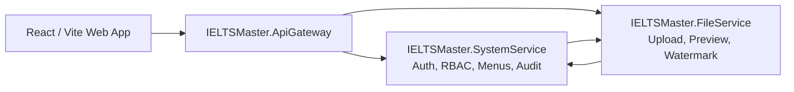

# BASEIELTSMASTER

Base system template for IELTSMaster: authentication, registration, users, roles, permissions, menus, system groups, audit logs, ELearning, API gateway, and Aspire orchestration.

## Stack

- .NET 8 services
- .NET 9 API Gateway
- .NET Aspire AppHost
- SQL Server via Entity Framework Core SQL Server provider
- React 19, TypeScript, Vite, Tailwind CSS
- Radix UI, TanStack Query, TanStack Table
- Vitest and Testing Library

## Kept Modules

```text
IELTSMaster.ApiGateway/          API gateway and service routing
IELTSMaster.AppHost/             .NET Aspire orchestration
IELTSMaster.FileService/         Upload, preview, watermark, and file APIs
IELTSMaster.ServiceDefaults/     Shared Aspire service defaults
IELTSMaster.Shared/              Shared DTOs, helpers, and cross-service contracts
IELTSMaster.SystemService/       Authentication, users, roles, menus, audit logs
IELTSMaster.SystemService.Tests/ System service tests
IELTSMaster.Web/                 React frontend
```

## Removed Domain Modules

The catalog, workflow, collaboration, and domain-specific frontend modules have been removed from the solution and source tree. The solution is intended as a clean starting point for a new system with shared administration features already in place.

## Architecture



## Database

SystemService uses SQL Server database `IELTSMASTER`:

```json
"ConnectionStrings": {
  "System": "Server=localhost\\SQLEXPRESS;Database=IELTSMASTER;Trusted_Connection=True;TrustServerCertificate=True;MultipleActiveResultSets=True"
}
```

The active provider is `UseSqlServer` in `IELTSMaster.SystemService/Configs/ConfigService.cs`.

SQL Server schema and stored procedures are provided under
`Database/SqlServer`. Run `01_schema.sql` first, then
`02_stored_procedures.sql` in SQL Server Management Studio or `sqlcmd`.
For a fresh database, run `03_seed_base_system.sql` to create base roles,
admin account, menus, and administrator permissions.
The application calls stored procedures for menu, role, permission, system
group, and user permission queries.

## Main Features

- Login, logout, refresh token
- Public account registration
- User management and profile update
- Role and permission management
- Menu and system group management
- Audit log listing and detail view
- Protected routes and shared layout
- File upload, download, preview, and watermark support
- API Gateway routing for SystemService and FileService

## Gateway Routes

- `/system/{**catch-all}` routes to SystemService API
- `/file/api/{**catch-all}` routes to FileService API
- `/file/{**catch-all}` routes to FileService static files

## Getting Started

### Prerequisites

- .NET SDK 8 or later
- Node.js and npm
- SQL Server Express with instance `localhost\SQLEXPRESS`
- Database `IELTSMASTER`

### Restore And Build

```powershell
dotnet restore IELTSMaster.sln
dotnet build IELTSMaster.sln -v minimal
```

### Initialize SQL Server

```powershell
sqlcmd -S "localhost\SQLEXPRESS" -E -i Database\SqlServer\01_schema.sql
sqlcmd -S "localhost\SQLEXPRESS" -E -i Database\SqlServer\02_stored_procedures.sql
sqlcmd -S "localhost\SQLEXPRESS" -E -i Database\SqlServer\03_seed_base_system.sql
```

Default seeded account:

- Username: `admin`
- Password: `Admin@123`

### Run With Aspire

```powershell
dotnet run --project IELTSMaster.AppHost\IELTSMaster.AppHost.csproj
```

### Frontend Only

```powershell
Push-Location IELTSMaster.Web
npm install
npm run dev
Pop-Location
```

## Testing

```powershell
dotnet test IELTSMaster.SystemService.Tests\IELTSMaster.SystemService.Tests.csproj
```

```powershell
Push-Location IELTSMaster.Web
npm test
Pop-Location
```
