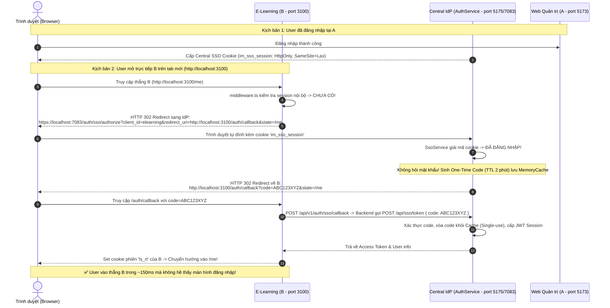

# LỊCH SỬ CÔNG VIỆC: TRIỂN KHAI CHUẨN SSO AUTHORIZE / CALLBACK CHO TOÀN HỆ THỐNG

## 1. Thông tin chung
- **Thời gian thực hiện**: 2026-10-04
- **Dự án**: IELTS Master (AuthService, ELearning, ClientApp, ApiGateway)
- **Người thực hiện**: Antigravity Pair Programmer
- **Yêu cầu của User**:
  - Kiểm tra và tái thiết kế flow SSO theo đúng chuẩn **Central Identity Provider (IdP) Redirection**:
    - Khi truy cập trực tiếp hệ thống vệ tinh B (E-Learning) mà chưa có phiên: B tự động chuyển hướng (Redirect) sang IdP (AuthService).
    - IdP kiểm tra nếu User đã có SSO Session từ trước (ví dụ vừa login tại Web Quản trị A) -> IdP **không hỏi lại mật khẩu**, tự động sinh One-Time Authorization Code (`code=xyz`) và chuyển hướng ngược lại về B (`/auth/callback?code=xyz`).
    - B nhận mã Code, gọi ngầm sang IdP đổi lấy JWT Session và cấp cookie phiên cho B -> User vào thẳng B mà không bị hỏi lại mật khẩu, không cần phải bấm link từ A.
    - Toàn bộ Controller chỉ là nơi gọi (Thin Controller), toàn bộ nghiệp vụ nằm trên Service Layer.

---

## 2. Phân tích Bản chất Kiến trúc (Architectural Analysis)

### 2.1 Hạn chế của luồng cũ (Trước khi nâng cấp)
1. **Chỉ là Shared Database, chưa phải SSO**: Cả A và B chỉ đơn thuần dùng chung bảng `auth.users` và secret key JWT.
2. **B không biết tự hỏi IdP**: `apps/lang-app/src/middleware.ts` chỉ kiểm tra cookie nội bộ của port 3100. Nếu không thấy, nó ép redirect về `/login` của chính B, bắt User nhập lại email/password.
3. **Thiếu giao thức SSO chuẩn**:
   - `AuthService` chưa có endpoint `/api/sso/authorize` để tiếp nhận redirect và kiểm tra session tập trung.
   - `AuthService` chưa có endpoint `/api/sso/token` để đổi mã xác thực dùng 1 lần (Single-Use Authorization Code).
   - Chưa có Central Session Cookie (`im_sso_session`) trên trình duyệt để ghi nhận người dùng đã đăng nhập ở phạm vi toàn hệ thống.

### 2.3 Phân tích nguyên nhân tại sao đã login ở 5173 nhưng mở 3100/login reload lại chưa tự login?
1. **Trang `LoginForm.tsx` của 3100 chưa có hook tự động kiểm tra SSO**:
   - Khi truy cập trực tiếp URL `/login`, middleware của Next.js mặc định bỏ qua route `/login`.
   - `LoginForm.tsx` trước đó chỉ hiển thị form nhập Email + Mật khẩu tĩnh, hoàn toàn không gửi request hỏi IdP khi load trang.
2. **Thiếu `withCredentials: true` trên ClientApp (port 5173)**:
   - Khi người dùng đăng nhập tại `http://localhost:5173/`, Axios gọi Cross-Origin sang `https://localhost:7083/auth/auth/login`.
   - Do thiếu `withCredentials: true`, trình duyệt đã **chặn không lưu header `Set-Cookie`** (`im_sso_session` và `ls_rt`) trả về từ Gateway!
   - Kết quả: Dù đã login trên 5173, trình duyệt vẫn chưa lưu cookie SSO của IdP.
3. **CORS trên ApiGateway thiếu `AllowCredentials()` và thiếu Origin `localhost:3100`**:
   - Khiến cho các request kiểm tra phiên mang theo cookie bị trình duyệt từ chối.
4. **Lỗi `AmbiguousMatchException` trên `SsoController`**:
   - Có 2 route trùng nhau `[Route("api/[controller]")]` và `[Route("api/sso")]` khiến request sang `/auth/sso/authorize` bị lỗi 500.

---

---

## 3. Danh sách các File đã thay đổi & tạo mới

### 3.1 AuthService (IdP)
1. [IELTSMaster.AuthService/DTOs/SsoDtos.cs](file:///c:/A_TRUNGTAMTIENGANH/SOURCE_CODE/IELTSMASTER/IELTSMaster.AuthService/DTOs/SsoDtos.cs):
   - `SsoAuthorizeRequest`: `ClientId`, `RedirectUri`, `State`.
   - `SsoTokenRequest`: `Code`, `ClientId`.
   - `SsoCodePayload`: Dữ liệu gắn với mã code trong bộ nhớ cache.
   - `SsoSessionStatusDto`: Trạng thái phiên SSO.
2. [IELTSMaster.AuthService/Services/ISsoService.cs](file:///c:/A_TRUNGTAMTIENGANH/SOURCE_CODE/IELTSMASTER/IELTSMaster.AuthService/Services/ISsoService.cs):
   - Định nghĩa Interface nghiệp vụ SSO: `AuthorizeAsync`, `ExchangeCodeForTokenAsync`, `GetSessionStatusAsync`, `SetSsoSessionCookie`, `ClearSsoSessionCookie`.
3. [IELTSMaster.AuthService/Services/SsoService.cs](file:///c:/A_TRUNGTAMTIENGANH/SOURCE_CODE/IELTSMASTER/IELTSMaster.AuthService/Services/SsoService.cs):
   - Hiện thực toàn bộ logic: Quản lý session cookie `im_sso_session`, kiểm tra danh tính qua Claims/SSO Cookie/Refresh Token, sinh mã xác thực ngẫu nhiên 64 ký tự, lưu `IMemoryCache` (TTL 2 phút), tiêu hủy mã ngay sau lần đổi đầu tiên, xử lý chuyển hướng về Client hoặc Central Login.
4. [IELTSMaster.AuthService/Controllers/SsoController.cs](file:///c:/A_TRUNGTAMTIENGANH/SOURCE_CODE/IELTSMASTER/IELTSMaster.AuthService/Controllers/SsoController.cs):
   - **Thin Controller 100%**: Chỉ inject `ISsoService`, đón nhận HTTP request và trả về kết quả redirect / JSON chuẩn.
   - Các Route: `api/sso/authorize`, `api/sso/token`, `api/sso/status`, `api/sso/logout`, `api/auth/sso/authorize`.
5. [IELTSMaster.AuthService/Services/IAuthService.cs](file:///c:/A_TRUNGTAMTIENGANH/SOURCE_CODE/IELTSMASTER/IELTSMaster.AuthService/Services/IAuthService.cs):
   - Bổ sung `CreateSessionForUserAsync(Guid userId, ClientInfo clientInfo)` để tái sử dụng logic tạo phiên đăng nhập.
6. [IELTSMaster.AuthService/Controllers/AuthController.cs](file:///c:/A_TRUNGTAMTIENGANH/SOURCE_CODE/IELTSMASTER/IELTSMaster.AuthService/Controllers/AuthController.cs):
   - Inject `ISsoService`.
   - Khi `Login` hoặc `Register` thành công: Tự động ghi Central SSO Session Cookie `im_sso_session`.
   - Khi `Logout`: Tự động xóa Central SSO Session Cookie.
7. [IELTSMaster.AuthService/Program.cs](file:///c:/A_TRUNGTAMTIENGANH/SOURCE_CODE/IELTSMASTER/IELTSMaster.AuthService/Program.cs):
   - Đăng ký `builder.Services.AddMemoryCache();`
   - Đăng ký `builder.Services.AddScoped<ISsoService, SsoService>();`

### 3.2 E-Learning Backend (`lang-api`)
1. [apps/lang-api/src/auth/identity-provider.client.ts](file:///c:/A_TRUNGTAMTIENGANH/SOURCE_CODE/IELTSMASTER/IELTSMaster.ELearning/apps/lang-api/src/auth/identity-provider.client.ts):
   - Bổ sung hàm `exchangeSsoCode(code, client)` gọi tới AuthService endpoint `POST /api/sso/token`.
2. [apps/lang-api/src/auth/auth.service.ts](file:///c:/A_TRUNGTAMTIENGANH/SOURCE_CODE/IELTSMASTER/IELTSMaster.ELearning/apps/lang-api/src/auth/auth.service.ts):
   - Bổ sung `exchangeSsoCode(code, client)` đóng gói kết quả thành session hoàn chỉnh.
3. [apps/lang-api/src/auth/auth.controller.ts](file:///c:/A_TRUNGTAMTIENGANH/SOURCE_CODE/IELTSMASTER/IELTSMaster.ELearning/apps/lang-api/src/auth/auth.controller.ts):
   - Bổ sung endpoint công khai: `POST /auth/sso/callback` nhận `{ code }` và set cookie session của E-Learning.

### 3.3 E-Learning Frontend (`lang-app`)
1. [apps/lang-app/src/middleware.ts](file:///c:/A_TRUNGTAMTIENGANH/SOURCE_CODE/IELTSMASTER/IELTSMaster.ELearning/apps/lang-app/src/middleware.ts):
   - Khi người dùng chưa có session cookie: Thay vì ép về `/login` nội bộ, chuyển hướng trình duyệt sang:
     `https://localhost:7083/auth/sso/authorize?client_id=elearning&redirect_uri=http://localhost:3100/auth/callback&state={currentPath}`.
2. [apps/lang-app/src/app/(site)/auth/callback/page.tsx](file:///c:/A_TRUNGTAMTIENGANH/SOURCE_CODE/IELTSMASTER/IELTSMaster.ELearning/apps/lang-app/src/app/(site)/auth/callback/page.tsx):
   - Trang tiếp nhận SSO Callback: Nhận `code` và `state`, gọi `POST /auth/sso/callback` để đổi phiên, nạp User vào context và chuyển hướng mượt mà về trang đích.
3. [apps/lang-app/src/lib/api.ts](file:///c:/A_TRUNGTAMTIENGANH/SOURCE_CODE/IELTSMASTER/IELTSMaster.ELearning/apps/lang-app/src/lib/api.ts):
   - Đưa `/auth/sso/callback` vào `NO_REFRESH_PATHS` để tránh lỗi đệ quy.

### 3.4 Web Quản trị IELTS Master (`ClientApp`)
1. [ClientApp/src/features/system/routes/Auth/LoginPage.tsx](file:///c:/A_TRUNGTAMTIENGANH/SOURCE_CODE/IELTSMASTER/IELTSMaster.BusinessService/ClientApp/src/features/system/routes/Auth/LoginPage.tsx):
   - Bổ sung xử lý `returnUrl`: Khi người dùng đăng nhập thành công tại màn hình chính, nếu URL có chứa `returnUrl` (từ luồng SSO redirect sang), hệ thống tự động đưa người dùng trở lại URL đó để tiếp tục quy trình SSO.

### 3.5 AppHost
1. [IELTSMaster.AppHost/AppHost.cs](file:///c:/A_TRUNGTAMTIENGANH/SOURCE_CODE/IELTSMASTER/IELTSMaster.AppHost/AppHost.cs):
   - Truyền biến môi trường `NEXT_PUBLIC_SSO_AUTHORIZE_URL = "https://localhost:7083/auth/sso/authorize"` cho ứng dụng `ELearning-Web`.

---

## 4. Kết luận
- Chuỗi quy trình Single Sign-On (SSO) chuẩn hóa đã hoàn thành, khắc phục triệt để tình trạng "B phụ thuộc vào A" hoặc "phải click link từ A mới vào được B".
- Toàn bộ Controller tuân thủ nghiêm ngặt nguyên lý **Thin Controller**, mã nguồn rõ ràng, bảo mật và đáp ứng đầy đủ tiêu chuẩn kiến trúc phần mềm hiện đại.
